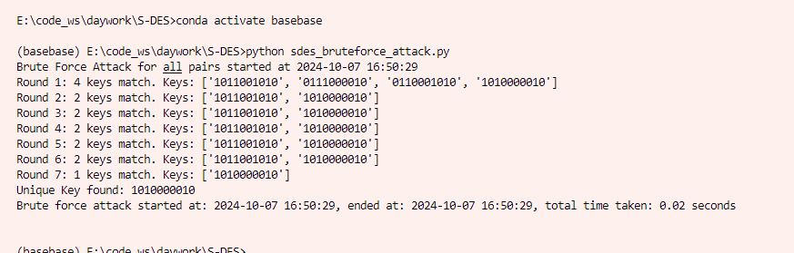

# S-DES 🔐

本项目是 **简化数据加密标准（S-DES）** 的实现，作为《信息安全导论》课程的一部分作业提交。项目包含多个模块，实现了核心加密算法，提供了图形用户界面（GUI），并展示了实际的加密、解密功能以及暴力破解的实现。该项目由小组合作完成，并进行了详细的测试，具体内容如下。

## 项目结构 📂

- **`sdes_base.py`**：S-DES 算法的核心实现，由 **何文轩** 编写。该文件处理基于 S-DES 规范的主要加密和解密逻辑。
  
- **`sdes_qtv1.py`**：使用 PyQt5 提供了一个基础的图形用户界面（GUI），这是最初版本的界面。

- **`sdes_qtv2.py`**：改进了 GUI，使用户界面更加友好，提供了更好的用户交互体验。

- **`sdes_base_o1.py`**：由 **吴佳宝** 编写的另一份 S-DES 算法实现代码，用于交叉测试，确保不同实现之间的结果一致性。

- **`sdes_qtv3.py`**：在 `sdes_qtv2.py` 的基础上进行了扩展，增加了对 **ASCII 字符串加密** 的支持，使工具更加实用。

- **`sdes_cipher_generator.py`**：该脚本生成了 50 对明文-密文对，并将其保存到 `ciphertext_results.txt` 文件中，用于后续的测试和验证。

- **`sdes_bruteforce_attack.py`**：实现了基于明文-密文对的暴力破解，能够成功找回加密密钥，破解过程的日志保存在 `bruteforce_results.txt` 中。

## 测试与验证 🧪

所有算法功能均由 **杨嘉乐** 进行详细测试与验证，测试包括以下内容：

- **第一关：基本功能测试**：确保核心算法在处理 8 位数据和 10 位密钥时能够正确运行，生成正确的加密和解密结果。

[<video src="movie.mp4.mp4" controls="controls" width="500" height="300"></video>](https://github.com/user-attachments/assets/2f68c712-f345-422b-a27d-a03b73d8001d)

- **第二关：交叉测试**：对不同算法实现（如 `sdes_base.py` 和 `sdes_base_o1.py`）的结果进行比较，以确保一致性。

<video controls>
  <source src="./.assets/sdes-2.mp4" type="video/mp4">
  Your browser does not support the video tag.
</video>


- **第三关：扩展功能测试**：验证 `sdes_qtv3.py` 能够正确处理 ASCII 字符串的加密和解密。

<video controls>
  <source src="./.assets/sdes-3.mp4" type="video/mp4">
  Your browser does not support the video tag.
</video>

- **第四关：暴力破解测试**：测试暴力破解的实现，确保能够成功恢复正确的加密密钥。

<video controls>
  <source src="./.assets/sdes-4.mp4" type="video/mp4">
  Your browser does not support the video tag.
</video>

- **第五关：封闭测试**：



> ### **封闭性与不同密钥的可能性：**
>
> 在我们的测试中，逐轮筛选密钥是基于不同的明文-密文对进行的。如果在某一轮中，存在多个密钥可以正确加密当前的明文到给定的密文，那么这些密钥会继续进入下一轮的测试。
>
> 最终，如果还有多个密钥符合条件，那就意味着有不同的密钥能够在加密相同的明文时，得到相同的密文。在我们的实验中，尽管有多轮匹配中存在多个密钥，但最终只剩下一个唯一的密钥。这表明对于所有给定的明文和密文，这个唯一的密钥是最符合条件的。**在我们的测试中，没有出现不同密钥（$$K_i \neq K_j$$）加密相同明文得到相同密文的情况**。这说明我们的加密过程在当前测试集合下是封闭的，只有一个正确的密钥。
>
> ### **理论上的可能性**：
>
> 虽然在实验中我们找到了唯一的密钥，但在理论上，简化版的 DES（比如 S-DES）由于其较小的密钥空间和结构，可能存在某些情况，其中不同的密钥会对相同的明文产生相同的密文。这种现象称为**密钥碰撞**，是由于较小的密钥空间导致的。
>
> 对于标准的 DES 或其他更复杂的加密算法，其密钥空间更大，发生密钥碰撞的可能性显著降低。

## 使用方法 💻

1. **运行核心算法**：
  
    ```bash
    python sdes_base.py
    ```
    
    
    
2. **启动 GUI**（最新版本）：
  
    ```bash
    python sdes_qtv3.py
    ```
    
    
    
3. **生成明文-密文对**：
  
    ```bash
    python sdes_cipher_generator.py
    ```
    
    
    
4. **执行暴力破解**：
  
    ```bash
    python sdes_bruteforce_attack.py
    ```
    
    

## 未来工作 🔮

- 优化图形用户界面，提升用户体验。
- 使用并行处理优化暴力破解，进一步提高破解效率。
- 扩展算法，支持更大数据集的加密以及其他编码格式。

