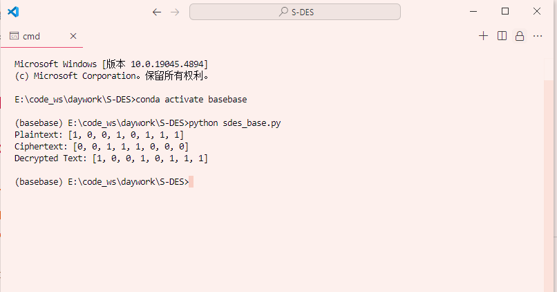
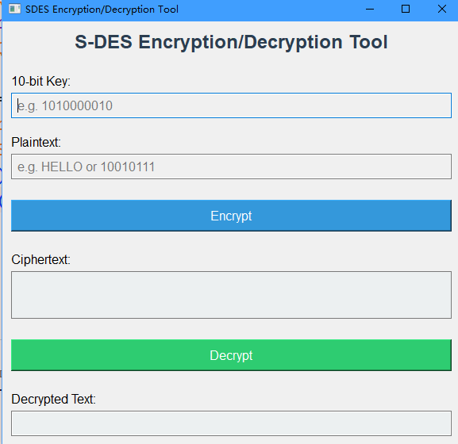
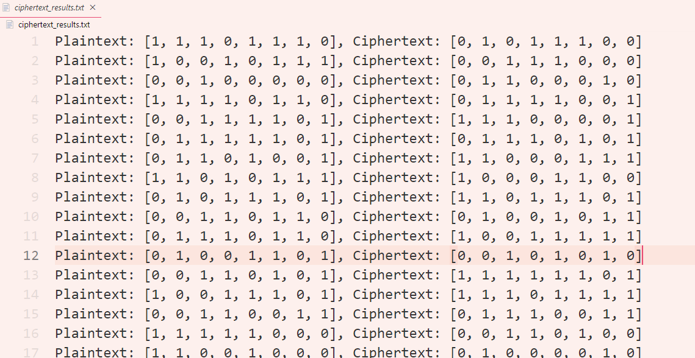
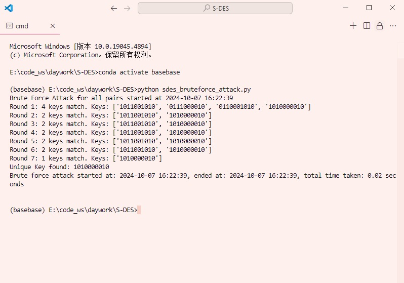

# S-DES 🔐

本项目是 **简化数据加密标准（S-DES）** 的实现，作为《信息安全导论》课程的一部分作业提交。项目包含多个模块，实现了核心加密算法，提供了图形用户界面（GUI），并展示了实际的加密、解密功能以及暴力破解的实现。该项目由小组合作完成，并进行了详细的测试，具体内容如下。

## 项目结构 📂

- **`sdes_base.py`**：S-DES 算法的核心实现，由 **何文轩** 编写。该文件处理基于 S-DES 规范的主要加密和解密逻辑。
  
- **`sdes_qtv1.py`**：使用 PyQt5 提供了一个基础的图形用户界面（GUI），这是最初版本的界面。

- **`sdes_qtv2.py`**：改进了 GUI，使用户界面更加友好，提供了更好的用户交互体验。

- **`sdes_base_o1.py`**：由 **吴佳宝** 编写的另一份 S-DES 算法实现代码，用于交叉测试，确保不同实现之间的结果一致性。

- **`sdes_qtv3.py`**：在 `sdes_qtv2.py` 的基础上进行了扩展，增加了对 **ASCII 字符串加密** 的支持，使工具更加实用。

- **`sdes_cipher_generator.py`**：该脚本生成了 50 对明文-密文对，并将其保存到 `ciphertext_results.txt` 文件中，用于后续的测试和验证。

- **`sdes_bruteforce_attack.py`**：实现了基于明文-密文对的暴力破解，能够成功找回加密密钥，破解过程的日志保存在 `bruteforce_results.txt` 中。

## 测试与验证 🧪

所有算法功能均由 **杨嘉乐** 进行详细测试与验证，测试包括以下内容：
1. **基本功能测试**：确保核心算法在处理 8 位数据和 10 位密钥时能够正确运行，生成正确的加密和解密结果。
2. **交叉测试**：对不同算法实现（如 `sdes_base.py` 和 `sdes_base_o1.py`）的结果进行比较，以确保一致性。
3. **扩展功能测试**：验证 `sdes_qtv3.py` 能够正确处理 ASCII 字符串的加密和解密。
4. **暴力破解测试**：测试暴力破解的实现，确保能够成功恢复正确的加密密钥。

测试结果存储在以下文件中：
- **`ciphertext_results.txt`**：包含系统生成的 50 对明文-密文对。
- **`bruteforce_results.txt`**：暴力破解的日志文件，展示了成功找到正确密钥的过程。

项目的 **演示视频** 以及更详细的测试说明将在稍后提供。

## 使用方法 💻

1. **运行核心算法**：
    
    ```bash
    python sdes_base.py
    ```
    
    
    
2. **启动 GUI**（最新版本）：
    
    ```bash
    python sdes_qtv3.py
    ```
    
    
    
3. **生成明文-密文对**：
    
    ```bash
    python sdes_cipher_generator.py
    ```
    
    
    
4. **执行暴力破解**：
    
    ```bash
    python sdes_bruteforce_attack.py
    ```
    
    

## 未来工作 🔮

- 优化图形用户界面，提升用户体验。
- 使用并行处理优化暴力破解，进一步提高破解效率。
- 扩展算法，支持更大数据集的加密以及其他编码格式。

